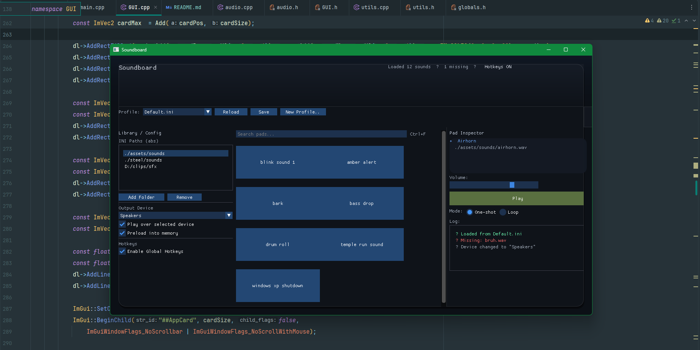

# Soundboard 
**Soundboard** is a modern audio playback application built with **C++**, **Dear ImGui**, and **miniaudio**.
> Inject MP3 files into voice audio streams, control volume, and manage multiple sound profiles.



---

## 🎵 Features
- **Instant Playback** - Click a button to play MP3 files
- **Volume Control** - Master volume slider (0.0 - 1.0)
- **Stop All** - Kill all playing sounds instantly
- **Search** - Filter sounds by name
- **Profile System** - Multiple configuration support (WIP)
- **Custom UI** - Dark themed interface with gradients
- **Auto-Load** - Scans `assets/sounds/` + reads `config.ini` paths
- **Direct3D 11** - Hardware accelerated rendering

---

## 📦 Requirements
- **OS:** Windows 10/11
- **Compiler:** MSVC or MinGW-w64
- **Libraries:** miniaudio, Dear ImGui, DirectX 11, mini-ini

---

## ⬇️ Installation

1. **Clone the repo:**
   ```bash
   git clone https://github.com/cw-0/Soundboard/tree/master
   cd soundboard
   ```

2. **Directory structure:**
   ```
   Soundboard/
   ├── assets/
   │   ├── sounds/          # Put MP3s here
   │   └── config.ini       # Auto-generated
   ├── include/             # Headers
   ├── src/                 # Source
   └── README.md
   ```

3. **Add MP3 files:**
    - Drop files into `assets/sounds/`
    - Or add absolute paths to `config.ini`

4. **Build:**
   ```bash
   mkdir build && cd build
   cmake ../CMakeLists.txt
   ninja
   ./Soundboard.exe
   ```

---

## ⚙️ Configuration

### config.ini Format
```ini
[sounds]
airhorn = C:/path/to/airhorn.mp3
explosion = D:/sounds/explosion.mp3
laugh = C:/audio/laugh.mp3
```
- Sounds in `assets/sounds/` load automatically
- `[sounds]` section for absolute paths
- Key = display name, Value = file path

---

## 🎮 Usage

### Controls
| Action | How |
|--------|-----|
| Play Sound | Click any sound pad |
| Volume | Drag slider in right panel |
| Stop All | Click "Stop" button |
| Search | Type in search box |

### Keyboard Shortcuts
- `Ctrl+F` - Focus search (planned)
- Global hotkeys (planned)

---

## 📁 Project Structure

```
include/
├── audio.h              # Audio engine API
├── globals.h            # Global soundVector
├── GUI.h                # GUI namespace
├── sound.h              # Sound class
├── utils.h              # String utilities
└── validateFiles.h      # File validation

src/
├── audio.cpp            # miniaudio wrapper
├── globals.cpp          # Globals
├── GUI.cpp              # ImGui interface
├── main.cpp             # Entry point
├── sound.cpp            # Sound implementation
├── utils.cpp            # Utilities
└── validateFiles.cpp    # INI + validation
```

---

## 🧪 Known Issues
- [ ] Reload, Save, New Profile buttons non-functional
- [ ] Hotkey system not implemented
- [ ] Per-sound volume control missing
- [ ] Loop mode not functional
- [ ] Device selection disabled

If you find bugs, open an Issue with:
- Windows version
- Compiler + version
- Steps to reproduce
- Error messages

---

## 🛣️ TODO
- [ ] Per-sound volume control
- [x] Loop mode support
- [x] Allow reloading/refreshing sounds
- [ ] Profile save/load
- [ ] Global hotkey support
- [ ] Drag-and-drop import
- [ ] WAV/OGG/FLAC support
- [ ] Add Game Preset Sounds/Profiles (Select Different Folders to Play From)

---

## 🧾 Building From Source


## 🤝 Contributing
PRs are welcome!
- Keep changes focused
- Describe what you changed + why
- Test the build

---

## 📜 License
This project is licensed under MIT - see `LICENSE` for details.

---

## 👨‍💻 Credits
- **Author:** Caden
- **[miniaudio](https://miniaud.io/)** by David Reid
- **[Dear ImGui](https://github.com/ocornut/imgui)** by Omar Cornut
- **[mini-ini](https://github.com/metayeti/mINI)** - INI parser

---
